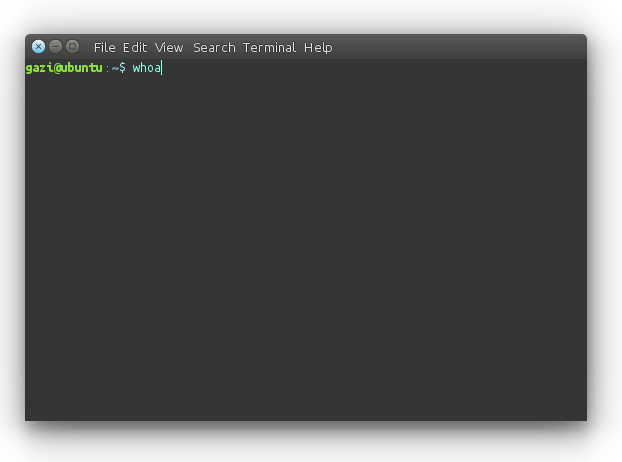

Getting Started with Linux
=======================================

Normally, "Basic Operations on Linux" or "Basic Operations and commands on Linux" were more fit to title. But on Linux, commands comes first.

If this is your first boot of Linux, We recommend to explore environment via your mouse and keyboard in normal way first. You can open File Manager with launcher pane on left. Your home directory will appear. You can simply right click and say new folder or new document. And may be you want to see some Wiki stuff via Firefox or listen some music via rhythmbox.

Basic Commands and Operations on Linux
-----------------------------------------------
	
Now, let's use Linux in its normal way. If you've installed Ubuntu correctly, You can open up a terminal window by clicking its icon on the launcher or typing terminal on start menu, or ``Ctrl + Alt + T`` keyboard shortcut. 

The terminal screen will appear like that:

First, let's try simple commands. To an opened terminal, just type ``whoami`` then press enter. This command prints your username: 

.. warning::

	If you are copying command to past to your terminal from here, Please do NOT copy that dollar sign. It just shows the area below is command. And, your terminal already has got that sign.
	
::
	
	$ whoami
	
Then type ``ls``. This command lists directory content. Also you can use ``pwd`` command to see which directory are you in.

::
	
	$ ls 

::
	
	$ pwd 

If you are bored in that directory, You can ramble on others. Change directory command is ``cd``. This command takes a parameter, directory. For example:

::
	
	$ cd /usr/bin

This command takes you to bin directory which under usr directory. Also usr folder is  under root(``/``) directory. On the left of your typing area, you can see your username, your computer's hostname, the path of which directory are you in, and the your user's type: dollar sign (``$``) for standart user, octothorpe (``#``) for a root user.

Most of programs recognize your home path via ``~`` (tilde) character. Non parameterized version of ``cd`` command redirects you to your user's home folder:

::
	
	$ cd

Let's create something. For a creating text file named ``my_first.txt``, use ``touch`` command in your terminal. If you are in home directory, it will create successfully:

::
	
	$ touch my_first.txt

And now, see the file which you've created. Say ``ls`` to list files and folders:

::
	
	$ ls

For an editing that text file, use default editor ``gedit``:

::
	
	$ gedit my_first.txt

And type something in it, and save the file in menu or use ``Ctrl + S`` shortcut. Then exit the ``gedit``. Your terminal will free to type commands after closing the ``gedit`` application.

If you want to print that text file's content, use ``cat`` command:

::
	
	$ cat my_first.txt

Also if you want to stay in terminal screen, you can use ``nano``, instead of ``gedit``.

For creating directory from command line, use ``mkdir`` command. If your paths which you gave to your commands are starts with ``/`` character, You must use full path of it. If it is not, you can use simple names:

::
	
	$ mkdir my_folder_123

It will create folder named ``my_folder_123``. You can see it via ``ls`` command if you want. 

Next command in this tutorial is ``cp``. It copies from ``<source path>`` to ``<destination path>``. If you are in your home, type directly, if you aren't, you know what command you need before doing it:

::
	
	$ cp my_first.txt my_folder_123/my_first.txt

It copies your file to that folder which you've created before. Also you don't need to use this command in your home directory, if your username is ``frodo``, just type(if not, replace ``frodo`` with your username):

::
	
	$ cp /home/frodo/my_first.txt /home/frodo/my_folder_123/my_first.txt

If you want to more clear view on your terminal screen, may be you want to colourize it. For doing it, open your ``.bashrc`` file and find ``#force_color_prompt=yes`` line and delete first octothorpe (``#``) character from that. And save the file. After restart of your terminal window you will see the changes. For editing ``.bashrc`` file, type:

::
	
	$ gedit ~/.bashrc

Next command can be dangerous but if you know what are you doing, that command gives you a permissions for real control of your pc. Note that ``sudo`` command wants your password to give you a permission and when you entering pasword to command line, it doesn't show some asterisk characters (``****``) or some dots (``••••``). Don't worry about it, just type your password.

::
	
	$ sudo whoami

Now, you executed that command via root user privileges. Hence, it prints ``root`` instead of your username.

This ``&&`` characters allow you to enter multiple commands at the same time:

::
	
	$ whoami && sudo whoami

Installing application package from saved repositories, is really simple. You should use this prefix to install: ``sudo apt-get install``. Also for removing, use: ``sudo apt-get remove``. If you've installed ROS before, you can install Milvus Robotics' MRP2 Robot's gazebo packages for simulating it via 

::
	
	$ sudo apt-get install ros-indigo-mrp2-gazebo

But be sure, The ROS packages installed correctly before running it. Possibly they didn't, just ignore it, We'll show you this and more stuff in next tutorials.

Our last command in this tutorial is ``man``. You can use ``man`` to read manuals of commands to help. For example:

::
	
	$ man touch

or 

::
	
	$ man rm

etc. For more information, you can see: `Using the terminal on Ubuntu <https://help.ubuntu.com/community/UsingTheTerminal>`_ page.

