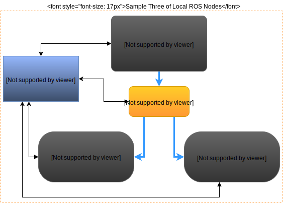
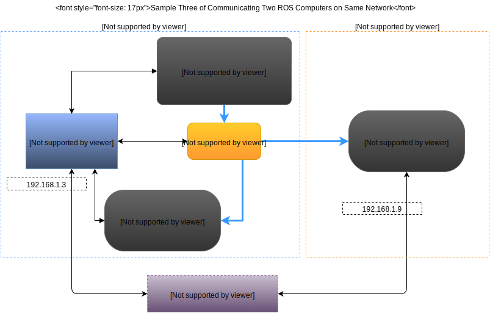
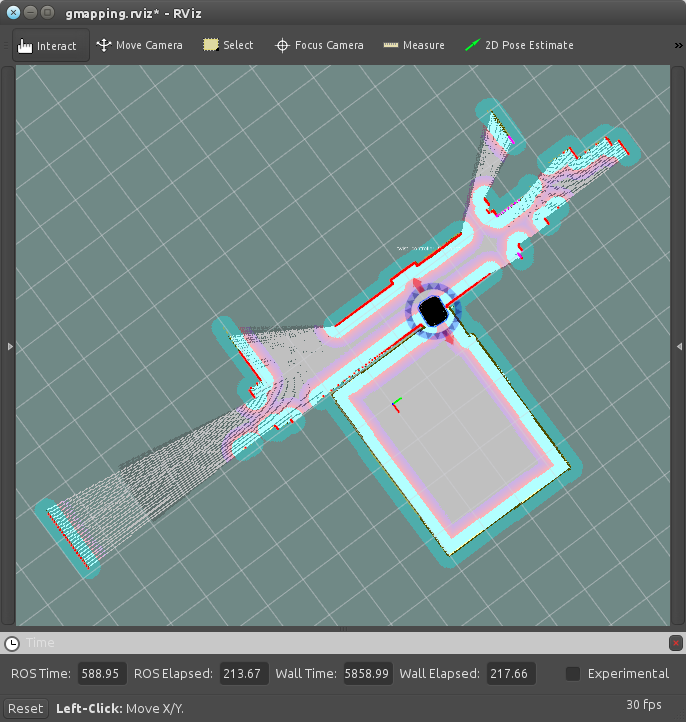

Introduction to Robot Operating System (ROS)
=============================================

ROS is a collection of software frameworks for robot software development, providing operating system-like functionality on a heterogeneous computer cluster. ROS provides standard operating system services such as hardware abstraction, low-level device control, implementation of commonly used functionality, message-passing between processes, and package management.

Running sets of ROS-based processes are represented in a graph architecture where processing takes place in nodes that may receive, post and multiplex sensor, control, state, planning, actuator and other messages. For more basic information, visit: `ROS - Wikipedia <https://en.wikipedia.org/wiki/Robot_Operating_System>`_

The Linux already has a power of useful applications, libraries, comunication drivers etc. ROS installation comes to a ready Operating System. Linux makes easier to create robotic systems by handling background parts of ROS. 

ROS currently runs on Unix-based platforms only. Software for ROS is primarily tested on Ubuntu and Mac OS X systems, though the ROS community has been contributing support for Fedora, Gentoo, Arch Linux and other Linux platforms.

Quick Overview of Graph Concepts
---------------------------------
	
`Nodes <http://wiki.ros.org/Nodes>`_: A node really isn't much more than an executable file within a ROS package. ROS nodes use a ROS client library to communicate with other nodes. Nodes can publish or subscribe to a Topic. Nodes can also provide or use a Service.

`Messages <http://wiki.ros.org/Messages>`_: Nodes communicate with each other by publishing messages to topics. A message is a simple data structure, comprising typed fields. Standard primitive types (integer, floating point, boolean, etc.) are supported, as are arrays of primitive types. Messages can include arbitrarily nested structures and arrays (much like C structs).

`Topics <http://wiki.ros.org/Topics>`_: Topics are named buses over which nodes exchange messages. Topics have anonymous publish/subscribe semantics, which decouples the production of information from its consumption. In general, nodes are not aware of who they are communicating with. Instead, nodes that are interested in data subscribe to the relevant topic; nodes that generate data publish to the relevant topic. There can be multiple publishers and subscribers to a topic.

`Master <http://wiki.ros.org/Master>`_: The ROS Master provides naming and registration services to the rest of the nodes in the ROS system. It tracks publishers and subscribers to topics as well as services. The role of the Master is to enable individual ROS nodes to locate one another. Once these nodes have located each other they communicate with each other peer-to-peer.

`rosout <http://wiki.ros.org/rosout>`_: System-wide logging mechanism for messages sent to the /rosout topic. ROS equivalent of stdout/stderr

`roscore <http://wiki.ros.org/roscore>`_: Roscore is a collection of nodes and programs: Master + rosout + parameter server, that are pre-requisites of a ROS-based system.

Sample communication on local network
-------------------------------------

The Publisher node generates and sends some message to chatter topic. That diagram doesn't show but the message has parameter to assign message to specific node. 

That two subscribers are listening the chatter topic. And if the message's id is same with that node's id. It processes the message.

Sample Communication of Two ROS PCs
-----------------------------------

In this example, We have a robot that connected to our home wifi network and rambles in our house. Otherside, Our PC is connected to same network. Note that if there is one ROS master is running on Robot side, there is no need to open second master if we aren't doing some experimental things.

The laser_sensor_node is hardware node and it connected to laser range finder device via some channel (for ex. serial communication). It reads raw data and makes it readable by ros nodes. And publishes to ``laser_scan`` topic. 

The gmapping node subscribes to that ``laser_scan`` topic and it generates map with it via fusing other datas from other topics. 

Finally that the RViz node is running on our Personal Ubuntu computer, not in robot's computer. First, It locates ``laser_scan`` topic via previously defined ros_master with its ip. After that, Our RViz reads laser data from ``laser_scan`` topic via network channel.

Also In this example, RViz is connected to other topics and reads other datas. The Map data is one of them. Reads map and laser data to show laser data (red lines and dots) on the map for knowledge of where is the collusions or free areas from robot's view:

